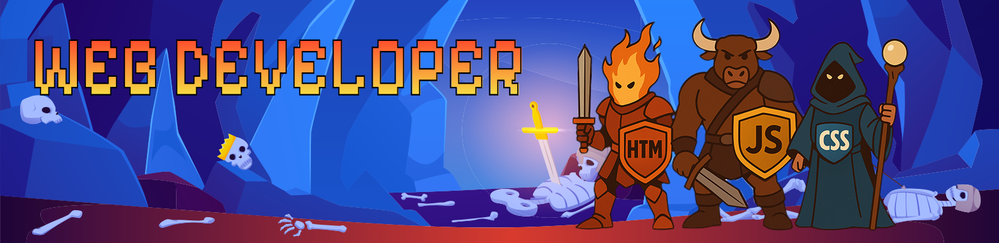
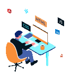

  

<h2 align="center">Hello there ⚔️! I'm Max Carmona, a Front-end web developer based in London, ON, Canada</h2>

###

  

###

  

###
<h2>📊 GitHub Stats</h2>

  
  

###
 
<h2>🚀 Languages and Tools I Use</h2>

  
  
  
  
  
  
  
  
  
  
  
  
  
  
  
  
  
  
  
  
  
  
  
  
  
  
  
  
  
  
  
  
  
  
  
  
  

###

 

## 🏆 GitHub Trophies

###

 

<picture>
  <source media="(prefers-color-scheme: dark)" srcset="https://raw.githubusercontent.com/MaxCarmonaG/MaxCarmonaG/output/pacman-contribution-graph-dark.svg">
  <source media="(prefers-color-scheme: light)" srcset="https://raw.githubusercontent.com/MaxCarmonaG/MaxCarmonaG/output/pacman-contribution-graph.svg">
  
</picture>

###
